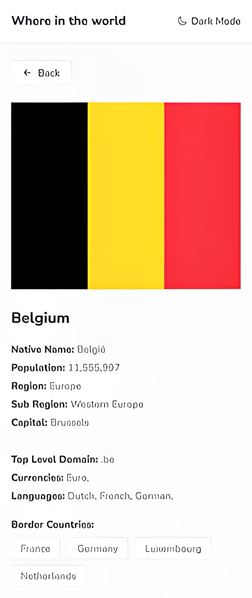

# Frontend Mentor - REST Countries API with color theme switcher solution

## Vite + React + Sass

This is a solution to the [REST Countries API with color theme switcher challenge on Frontend Mentor](https://www.frontendmentor.io/challenges/rest-countries-api-with-color-theme-switcher-5cacc469fec04111f7b848ca).

## Table of contents

- [Overview](#overview)
  - [The challenge](#the-challenge)
  - [Screenshot](#screenshot)
  - [Links](#links)
- [My process](#my-process)
  - [Built with](#built-with)
  - [What I learned](#what-i-learned)
  - [Useful resources](#useful-resources)
- [Author](#author)

## Overview

### The challenge

Users should be able to:

- See all countries from the API on the homepage
- Search for a country using an `input` field
- Filter countries by region
- Click on a country to see more detailed information on a separate page
- Click through to the border countries on the detail page
- Toggle the color scheme between light and dark mode *(optional)*

### Screenshot

#### Solution desktop preview

#### Solution mobile preview

### Links

- Solution URL: [https://github.com/Sarah-okolo/FEM-rest-countries-api-with-color-theme-switcher](https://github.com/Sarah-okolo/FEM-rest-countries-api-with-color-theme-switcher)
- Live Site URL: [where-1n-the-world.netlify.app](https://where-1n-the-world.netlify.app/)

## My process (in order)

- Created new Vite + React project.
- Installed Sass as a dependency.
- Initialized git repo and pushed project to GitHub.
- Deployed project to live site in Netlify.
- Created general styles for the app.
- Created and styled the countries home page.
- Fetched and rendered the JSON data for the countries.
- Implemented lazy loading for the countries on the home page.
- Created the countries search and filter feature.
- Created the countries details page.
- Implemented routing for each country from the home page to the details page.
- Made the app responsive by building out the mobile design.
- Created the app's light/dark theme toggle.

### Built with

- Semantic HTML5 markup
- Flexbox
- CSS Grid
- [Vite](https://vitejs.dev/) - local dev server
- [React](https://reactjs.org/) - JS library
- [Sass/SCSS](https://sass-lang.com/) - CSS preprocessor for styling

### What I learned

- **Light dark theme with React and Sass**: 
  Through this project, I was able to learn about how to implement a light and dark theme using react and sass.

- **React Routing**:
  My first time working routes in react. I learnt and understood more about how client-side routing works, along with the different ways to route between pages in react.

- **Infinite Scrolling using React**:
  I also learnt how to implement infinite scrolling feature in a react app.

- **Live search and filter**:
  The project's requirement for a search and filter feature provided the perfect opportunity for me to learn how to implement a live search and filter feature in a react app.

### Useful resources

- [React Tutorial](https://youtu.be/MHn66JJH5zs?si=GyRXO2KeqMCFosPA) - This tutorial helped me understand more about react routing.

## Author

- Frontend Mentor - [@Sarah-okolo](https://www.frontendmentor.io/profile/Sarah-okolo)
- Twitter - [@SahraOke](https://twitter.com/SahraOke)
